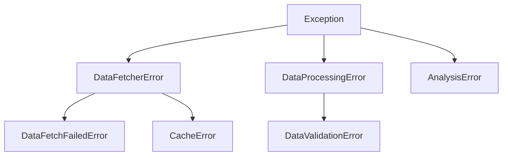

# Error Handling Documentation

## Error Hierarchy



## Error Codes Reference

### DataFetcher Errors
- **DFE-001**: DataFetcherError - Base class for data fetching errors
- **DFE-002**: DataFetchFailedError - Data fetching operation failed
- **DFE-003**: CacheError - Cache-related operation failed

### DataProcessing Errors
- **DPE-001**: DataProcessingError - Base class for data processing errors
- **DPE-002**: DataValidationError - Data validation failed

### Analysis Errors
- **ANE-001**: AnalysisError - Base class for analysis errors

## Usage Examples

### Data Fetching
```python
try:
    fetch_data()
except DataFetchFailedError as e:
    logger.error(f"Data fetch failed: {e.get_metadata()}")
```

### Data Processing
```python
try:
    process_data()
except DataValidationError as e:
    logger.error(f"Invalid data: {e.get_metadata()}")
```

### Analysis
```python
try:
    run_analysis()
except AnalysisError as e:
    logger.error(f"Analysis failed: {e.get_metadata()}")
```

## Troubleshooting Guide

1. **Data Fetching Issues**
   - Check network connectivity
   - Verify API endpoints
   - Validate authentication credentials

2. **Data Processing Issues**
   - Validate input data format
   - Check data schema
   - Verify processing rules

3. **Analysis Issues**
   - Check input data quality
   - Verify analysis parameters
   - Validate result ranges

## Best Practices

- Always include component and context when raising exceptions
- Use specific exception types rather than generic Exception
- Log error metadata for debugging
- Provide meaningful error messages
- Document error handling in code
